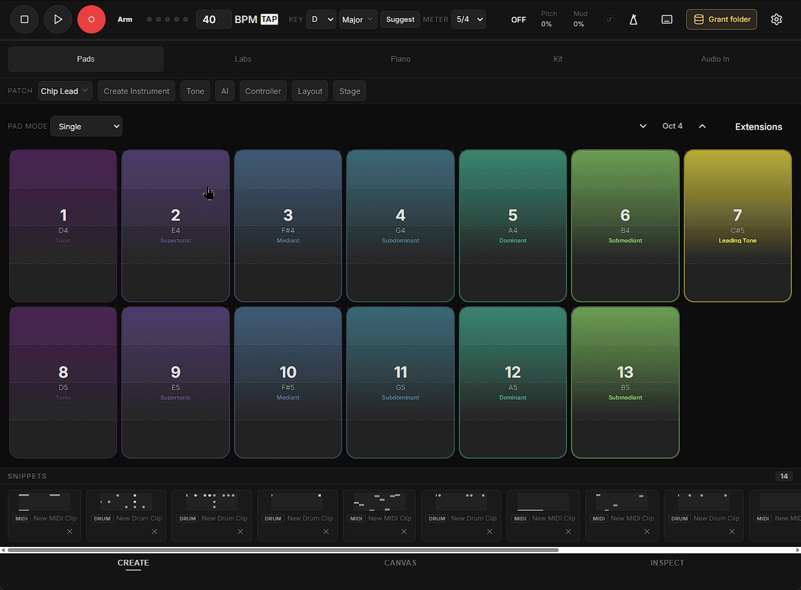
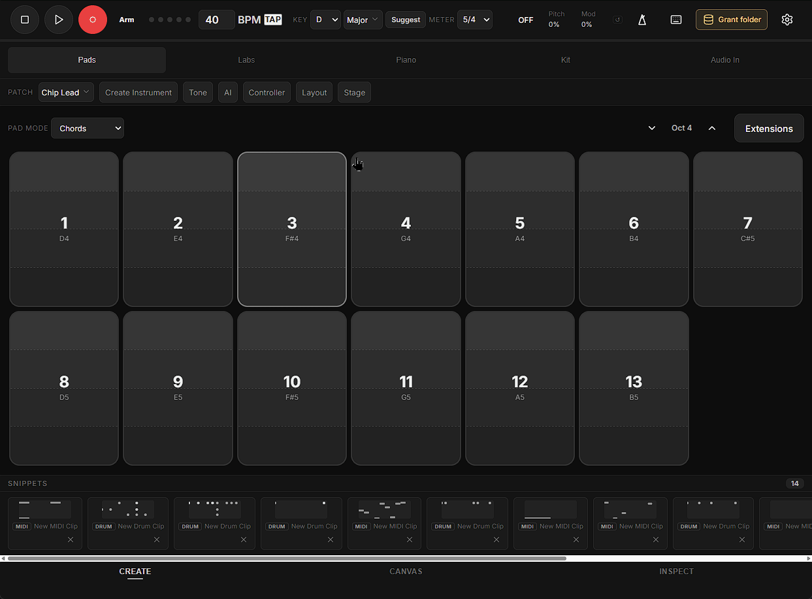
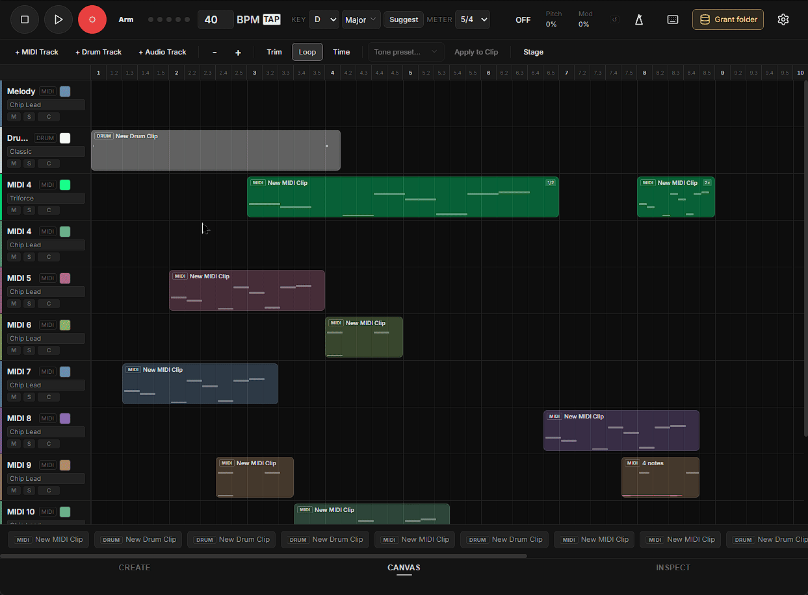
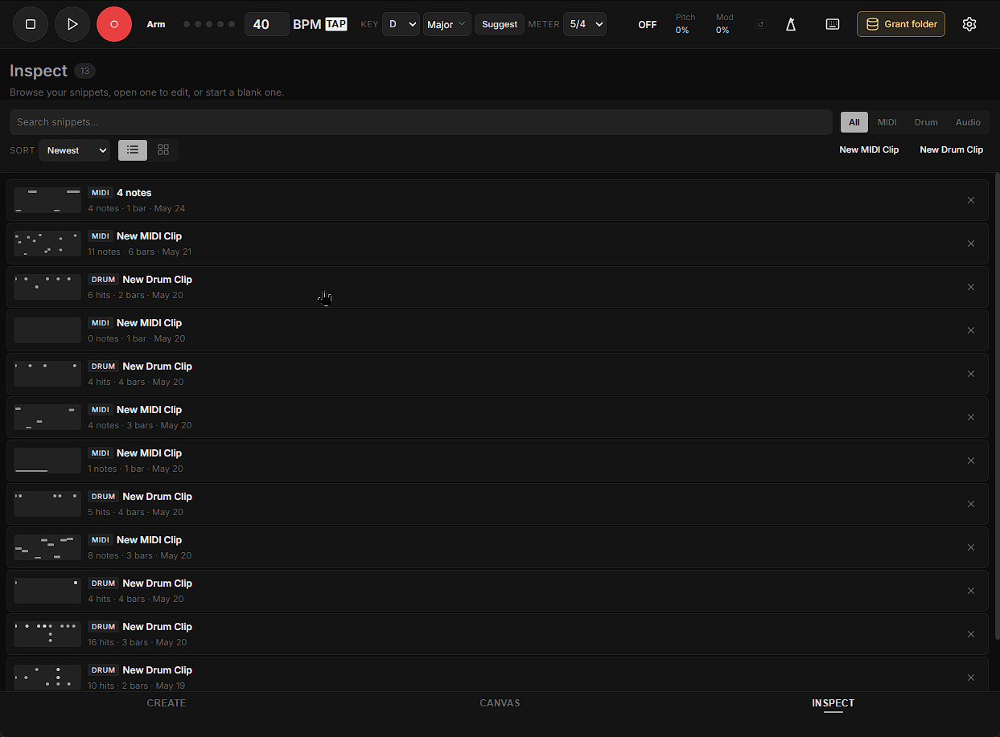
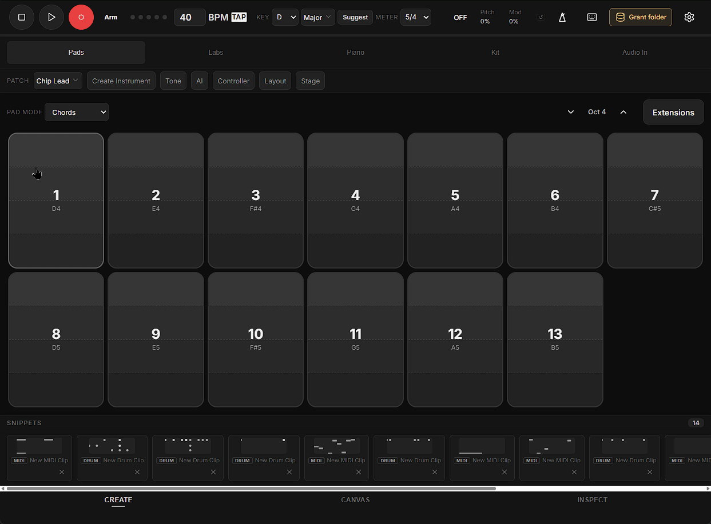

<div align="center">

# Notenotes

**A free, open-source pre-DAW: a place to catch a musical idea before it becomes
a production project.**

[Try it now](https://zeidalidiez.github.io/Notenotes/) |
[Report a bug or idea](https://github.com/zeidalidiez/Notenotes/issues/new) |
[Contribute](#contributing)

</div>

## Why it exists

Notenotes is the napkin sketch before the recording studio. It uses scale-locked
pads, a small piano, drums, a microphone, controllers, color, and shapes to make
music approachable without pretending to replace a DAW.

I built it because I am a long-time musician who still finds it hard to get an
idea into a DAW. Notenotes is a noodling board: find the hook here, then take it
somewhere else to finish the song.

- No account, telemetry, or hosted project service.
- Your workspace and audio stay in browser storage unless you export them.
- The core app works offline after it has been loaded and cached. Optional
  sample packs must be fetched once before they are available offline.
- It is installable as a Progressive Web App, but installation is optional.

Open the [live app](https://zeidalidiez.github.io/Notenotes/) and press a pad.
Browsers require a user gesture before they allow sound.

## A quick tour

### Create



Pick a key, scale, meter, and patch, then play Pads, Piano, Kit, Audio In, or a
connected controller. Record a take and it becomes a reusable snippet.



Pads can stay inside the project scale while Piano remains chromatic or uses
optional correction. The scale library includes Western modes, pentatonic
colors, and clearly labelled 12-TET approximations of several maqam- and
raga-inspired collections. Drum pads are rhythmic instruments and are not
described as being "in key."

Create includes 20 Chip, Modern, and FM synth presets; four synthesized drum
kits; friendly Tone controls; Height Velocity; Hold and Arpeggio modes; Step
Play; degree colors; chord suggestions; and gamepad, computer-keyboard, and Web
MIDI input.

### Canvas



Arrange MIDI, drum, and audio snippets on typed tracks. Move and trim clips,
switch half-time or double-time non-destructively, mute or solo tracks, set pan
and color, and export the result. Clips snap to useful edges and avoid accidental
overlaps.

### Inspect



Inspect is both the snippet library and the detail editor. Search, filter, and
sort the library, then edit MIDI notes, drum hits, velocity, lyrics, timing, and
clip length. Fit Rhythm can place an existing performance into one, two, or four
bars without changing its pitches or drum choices.



MIDI and drum snippets remember the patch or kit used to audition them and carry
that choice when first dropped on Canvas.

### Stage


Stage turns live Create input into Trace, Thread, Pulse, Halo, or Pocket
visualizations. From Canvas it shows the arranged tracks moving through a
performance view. Stage is intentionally a live visual surface today; recorded
video and GIF export are future work.

## Useful capabilities

- Record microphone audio and store the audio bytes separately from lightweight
  project metadata.
- Convert a monophonic Audio In recording to an editable MIDI starting point.
- Attach lyric text directly to MIDI notes so timing follows the note.
- Share MIDI and drum snippets through bounded, local-first links.
- Save milestones and adjustable auto-save history.
- Export workspace or snippet-library JSON backups, including referenced audio.
- Connect a local backup folder in supporting desktop browsers.
- Export MIDI, WAV, ABC, or SVG sheet music where the source type supports it.
- Use Tremor Filter, Dwell Play, Step Play, reduced-motion handling, accessible
  palettes, and URL-enabled accessibility profiles.
- Enable developer diagnostics with `?debug=1`.

Notenotes deliberately does not provide accounts, cloud sync, multitrack mixing
depth, arbitrary effects racks, or a runtime plugin marketplace.

## Run it locally

### Prerequisites

- Node.js 20.19+ or 22.12+
- npm

```bash
git clone https://github.com/zeidalidiez/Notenotes.git
cd Notenotes
npm ci
npm run dev
```

The development server opens at [http://localhost:5173/](http://localhost:5173/).

Before opening a pull request:

```bash
npm test
npm run build
```

Do not use `--legacy-peer-deps`; the checked-in dependency graph is expected to
install cleanly.

## Keyboard shortcuts

| Key | Action |
|---|---|
| `Space` | Play or pause; in Inspect, audition the open clip |
| `Enter` | Stop and return to the loop start |
| `Ctrl+Z` / `Ctrl+Shift+Z` | Undo / redo |
| `1`-`=`, `Q`-`]`, `A`-`'`, `Z`-`/` | Play the active Pads, Piano, or Kit surface |
| `ArrowUp` / `ArrowDown` | Shift the active instrument octave |
| `Delete` / `Backspace` | Delete the selected note or clip |
| `Shift` + drag note edge | Resize a MIDI note in Inspect |

When an instrument consumes a key as a playable note, it takes precedence over
a global shortcut.

## Technical shape

| Layer | Technology |
|---|---|
| Build | Vite 8 |
| Audio | Web Audio API |
| Persistence | IndexedDB through `idb` |
| Sheet music | `abcjs` |
| Offline install | `vite-plugin-pwa` |
| UI | Vanilla JavaScript ES modules |

Vanilla modules keep the current application direct and readable. Audio remains
stable because musical events are scheduled against the Web Audio clock and UI
rendering is kept off that clock, not because a particular framework is absent.

The code is organized by responsibility:

```text
src/
  engine/       timing, playback, theory, recording
  instruments/  playable surfaces and live sound
  modes/        Create, Canvas, and Inspect orchestration
  ui/           shared controls and settings
  data/         IndexedDB, migrations, history, audio assets
  export/       MIDI, WAV, ABC, and sheet music
  stage/        performance event model and visuals
```

See [the documentation index](docs/README.md),
[architecture](docs/architecture.md), and [contributor rules](AGENTS.md) before a
structural change.

## Roadmap

The bounded strategic roadmap lives in [docs/roadmap.md](docs/roadmap.md).
Actionable work belongs in [GitHub Issues](https://github.com/zeidalidiez/Notenotes/issues),
and early ideas belong in
[Discussions](https://github.com/zeidalidiez/Notenotes/discussions). A checklist
in the README is not treated as a second backlog.

## Contributing

1. Browse the [open issues](https://github.com/zeidalidiez/Notenotes/issues).
2. Use a Discussion for an idea that is not yet a bounded task.
3. Keep branches and pull requests small and focused.
4. Add the smallest regression test that would have caught a bug.
5. Run `npm test` and `npm run build` before publishing.

For browser, audio-device, touch, permission, and PWA checks, use the concise
[manual QA checklist](docs/manual-qa.md) and record the environment and result.

## Credits and licensing

- Controller artwork: [Generic Gamepad Template](https://opengameart.org/content/generic-gamepad-template)
  by [nicefrog](https://opengameart.org/users/nicefrog), CC0.
- [abcjs](https://paulrosen.github.io/abcjs/) for sheet-music rendering.
- [idb](https://github.com/jakearchibald/idb) for IndexedDB access.
- [vite-plugin-pwa](https://vite-pwa-org.netlify.app/) for install and offline support.
- [Lucide](https://lucide.dev) icons under the ISC License; see
  [THIRD_PARTY_NOTICES.md](THIRD_PARTY_NOTICES.md).
- [Greptile](https://www.greptile.com/) for code-review support.

Anything bundled into Notenotes that can appear in a user's exported audio must
be obligation-free for that user. Prefer CC0/public-domain audio; do not add
CC-BY, share-alike, noncommercial, unclear-license, or runtime-CDN sounds.

Notenotes is released under the [MIT License](LICENSE).
