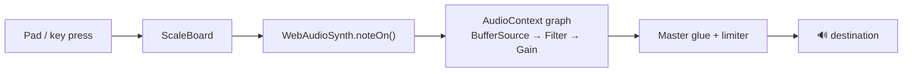
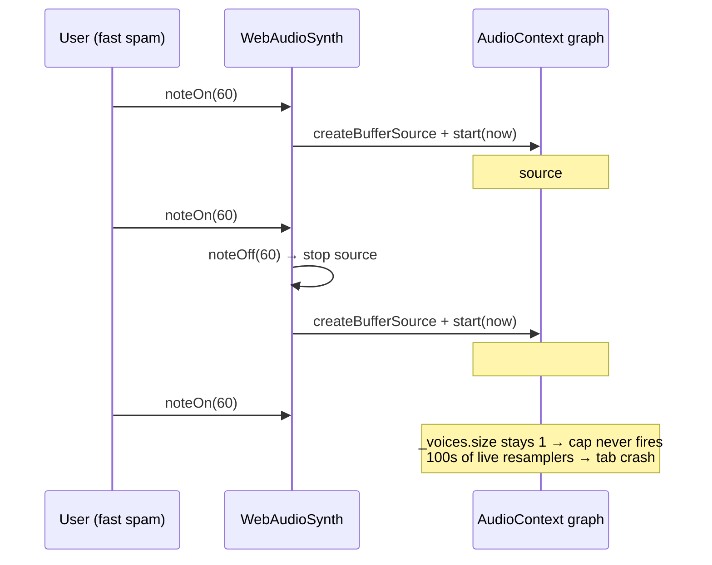
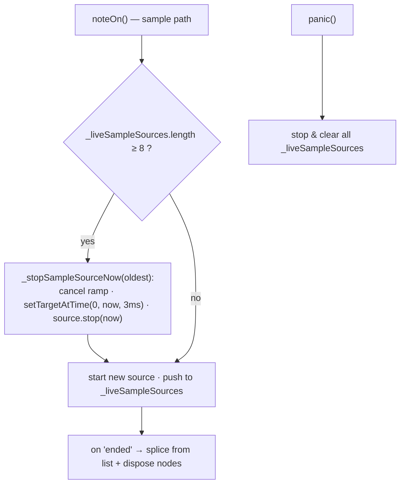
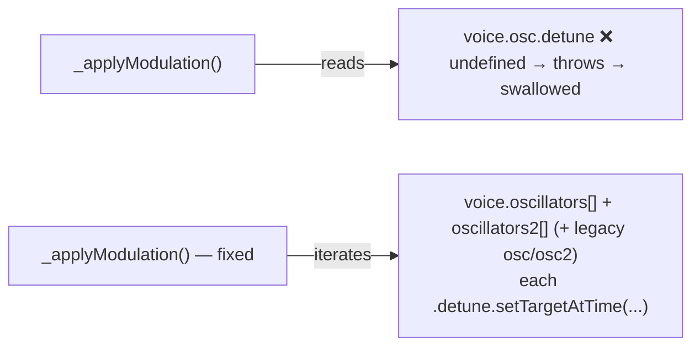
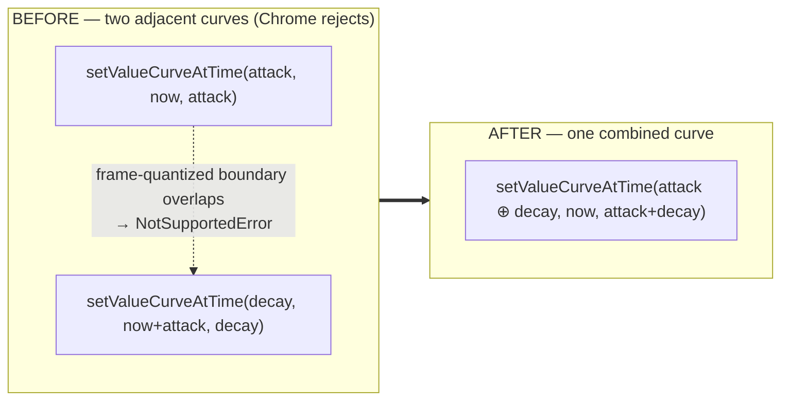
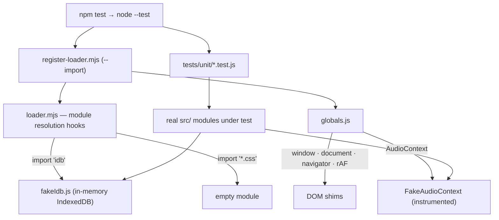

# Sample-Voice Crash Fix + Automated Test Harness

> Fixes the Windows-Chrome tab crash on fast sample-pad input, two related
> audio-engine bugs found along the way, and introduces the project's first
> real automated test suite — a zero-dependency `node --test` harness with an
> instrumented fake Web Audio engine.

## TL;DR

| Metric (200-trigger burst, real Chrome) | Before | After |
| --- | --- | --- |
| Peak concurrent live `AudioBufferSourceNode`s | **68** | **10** (cap 8 + fade tail) |
| `setValueCurveAtTime` `NotSupportedError`s thrown | **39–52** | **0** |
| Recorded pitch/mod reaching modern presets | dead | restored |
| Automated tests | 1 smoke file | **50 unit + 50 smoke**, all green |

Three real bugs fixed, each pinned by a regression test, verified both
headlessly and in a live browser. No new runtime dependencies.

---

## Background

Notenotes makes sound entirely through the Web Audio API: a pad press calls
`WebAudioSynth.noteOn()`, which builds a small graph of `AudioContext` nodes and
routes it to the master output.



The reported symptom: **hitting sample-based pads too fast crashed the browser
tab — only on Windows Chrome.** Sample instruments pitch-shift a single CC0
buffer by `playbackRate`, and Windows Chrome's audio backend is far less
tolerant of many simultaneous resamplers than macOS CoreAudio, so it tipped over
first. Before this work the only test was a single `tests/smoke.mjs`, so none of
the stateful audio code was covered.

---

## Bug 1 — Sample-voice node pileup → tab crash  ·  Critical

### Root cause

The polyphony cap (`MAX_VOICES = 8`) bounds the `_voices` **Map**, not the number
of **concurrently-live audio nodes**. Sample instruments default to `gated` mode
(`WebAudioSynth.js:355`, `PlaybackEngine.js:195`), and the gated `noteOn` path
starts a `BufferSource` but schedules **no stop** — a stop is only ever set in
the *future* (`now + release + 0.1` via `noteOff`, or `oneShot` only).

Spamming one pad keeps `_voices.size` at **1** (the leading `noteOff(midi)`
deletes the entry, the new `noteOn` re-adds it), so voice-stealing never fires
and every evicted source stays live in the graph until its future stop. Live
node count grows to roughly `sampleDuration / hitInterval` — hundreds.



The cruel irony: the existing `ended` listener — whose own comment fears exactly
this pileup — only *disposes* nodes **after** they stop. It never makes them stop
sooner, so it gave a false sense of safety.

### The fix — a hard ceiling on live sample nodes

Track live sample sources independently of the `_voices` map and force-stop the
oldest the moment a new trigger would exceed the cap, with a 3 ms declick fade
and a stop at `now` (not in the future).



Stopping at `now` (not `now + tail`) is what makes the bound deterministic — at
1 ms spacing any non-zero tail would keep extra nodes live past the cap.

- `src/instruments/WebAudioSynth.js` — `_liveSampleSources` list, the cap-and-evict
  loop in the gated path, `_stopSampleSourceNow()`, list cleanup in the `ended`
  handler and in `panic()`.
- The synth/oscillator path and `oneShot` are untouched.

### Evidence

`tests/unit/voiceLifecycle.test.js` asserts `liveBufferSources ≤ 8` under a
rapid burst (RED before: `got 68`/`got 200`; GREEN after). The bounded contrast
is proven by `sketchKit.test.js` — drums always scheduled `stop(t+decay)` at
trigger time and never piled up.

---

## Bug 2 — Recorded modulation silently dead on modern presets  ·  Medium

### Root cause

`PlaybackEngine._applyModulation` reached for `voice.osc.detune`, but modern
multi-oscillator voices store `oscillators[]` / `oscillators2[]` and have no
`voice.osc`. The property access threw into an empty `catch`, so recorded
pitch-bend and filter modulation did nothing on every modern instrument.



### The fix

Iterate the real oscillator stack and apply detune to each, optional-chained so a
missing shape is a clean skip instead of a swallowed throw. Backward-compatible
with any legacy `voice.osc`/`voice.osc2`.

- `src/engine/PlaybackEngine.js` — `_applyModulation`.
- Pinned by `tests/unit/playbackEngine.test.js`.

---

## Bug 3 — Envelope `setValueCurveAtTime` overlap  ·  Medium (real-browser-only)

### Root cause

`_scheduleAmpEnvelope` and `_scheduleFilterEnvelope` each scheduled **two
back-to-back `setValueCurveAtTime`** on the same param: an attack curve over
`[now, now+attack]` and a decay curve starting at `now+attack`. Chrome quantizes
automation event times to audio render frames; for certain `now` values the
decay's quantized start frame lands at-or-before the attack's quantized end
frame, and Chrome rejects it with `NotSupportedError`. It fired on ~20–26 % of
fast retriggers. Our fake AudioContext never modeled this rule, so the bug was
invisible until the change was driven through a real browser.



### The fix — collapse each pair into one curve

`createAttackDecayCurve()` (`src/engine/EnvelopeCurves.js`) builds a single
`Float32Array` over the full attack+decay span, allocating sample points
**proportional to each segment's duration** so the shape is identical to before.
Each schedule method now issues exactly **one** `setValueCurveAtTime` — the
overlap class is structurally impossible.

- Shape preserved → **WAV-export parity intact** (`WavExporter` renders envelopes
  through its own `adsrEnvelopeValueAt` math and never uses `setValueCurveAtTime`).
- A grep of the whole tree confirms these were the only two adjacent-curve sites.

### Evidence

The fake's `AudioParam` was taught Chrome's rule (throws on overlapping curve
ranges; `cancelScheduledValues` clears them) so this is now catchable headlessly.
`voiceLifecycle.test.js` adds rapid-retrigger `doesNotThrow` guards for both the
sample and synth paths (RED against the old two-curve code, GREEN after). Real
Chrome confirms the error count drops from 39–52 to **0**.

---

## The test harness

The project had no automated coverage of its stateful core. This adds a
**zero-dependency** suite on Node's native `node --test`, runnable headlessly in
CI with no browser and no `node_modules` beyond what the app already ships.



### `FakeAudioContext` — the centerpiece

A faithful, headless stand-in for the browser audio engine that makes audio
lifecycle *assertable*:

- **Manual advanceable clock** (`advance(seconds)`) — deterministic scheduler tests.
- **Node lifecycle tracking** — a source is "live" from `start()` until the clock
  crosses its scheduled `stop()`; inspectors `liveSourceCount(type)`,
  `createdCount`, `connectCount`/`disconnectCount`, `endedCount`.
- **AudioParam automation recording** — proves modulation reached a param.
- **Chrome's `setValueCurveAtTime` overlap rule** — throws on overlapping curve
  ranges (added with Bug 3) so that class of bug can never silently regress.

This is the instrument that turns "the tab crashes on fast pads" into a one-line
headless assertion: `ctx.liveSourceCount('BufferSource') <= cap`.

### Coverage today

| Suite | Tests | Covers |
| --- | --- | --- |
| `voiceLifecycle` | 10 | sample + synth voice node lifecycle, polyphony cap, `panic()`, **crash repro**, **envelope-overlap guards** |
| `projectStore` | 9 | IndexedDB save / load / forward-migration round-trips |
| `musicTheory` | 8 | scale, degree, and interval math |
| `recordingManager` | 7 | recording lifecycle |
| `fakeAudioContext` | 7 | self-tests for the harness's own fake |
| `playbackEngine` | 6 | tick / scheduling, modulation application |
| `sketchKit` | 3 | drum-voice bounding (the bounded contrast to Bug 1) |
| **Total** | **50** | + `tests/smoke.mjs` (50 pure-logic cases) |

### Running it

```bash
npm test           # smoke + unit (50 + 50)
npm run test:unit  # node --test over tests/unit/*.test.js
npm run test:smoke # the original pure-logic smoke file
```

### Purpose going forward

- **Regression safety net for the audio core** — the crash class, the modulation
  regression, and the envelope-overlap error are now all pinned; they cannot
  return silently.
- **A real fake to build on** — new audio features can be tested headlessly
  against `FakeAudioContext` instead of requiring a manual browser pass.
- **Prioritized next targets:** PlaybackEngine loop-edge / time-scaled note drops
  driven through the real Transport scheduler; backup-import sanitizer
  (untrusted JSON shape) once it exists; Transport pulse/beat/bar emission for
  compound meters; auto-save debounce flush-on-unload; WAV-export ↔ live-synth
  parity via `OfflineAudioContext`.

---

## Verification

- **Headless:** `npm test` → 50 unit + 50 smoke, zero failures.
- **Real Chrome (Playwright):** the actual app was booted on the Vite dev server;
  the real `AudioContext.createBufferSource` was instrumented in-page and the real
  `WebAudioSynth` gated sample path was driven with a 200-trigger burst. Peak live
  nodes dropped **68 → 10** and `NotSupportedError`s dropped **39–52 → 0** with the
  fixes applied. (The literal Windows tab-crash is not reproducible on Linux Chrome
  — a different audio backend — so this verifies the *mechanism and the bound*, not
  the OS-specific crash itself.)

## Files changed

```
 src/instruments/WebAudioSynth.js   crash-fix (live-node ceiling) + envelope fix
 src/engine/EnvelopeCurves.js       createAttackDecayCurve()
 src/engine/PlaybackEngine.js       modulation fix
 package.json                       test / test:unit / test:smoke scripts
 tests/fixtures/                    FakeAudioContext, fakeIdb, fakeTransport, globals, loaders
 tests/unit/                        7 suites, 50 tests
 docs/crash-fix-and-test-harness.md this document
```

## Out-of-scope follow-ups (noted, not addressed here)

- `WavExporter` re-implements the synth/drum DSP as a parallel ~900-line copy kept
  in sync by ear — a candidate for renderer unification with an automated parity
  check.
- Backup/restore imports parse untrusted JSON straight into the store with no
  shape allowlist or `__proto__` stripping — worth a sanitizer (and a test, which
  the harness is ready for).
